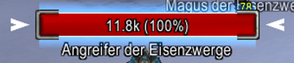
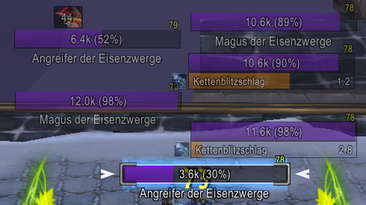
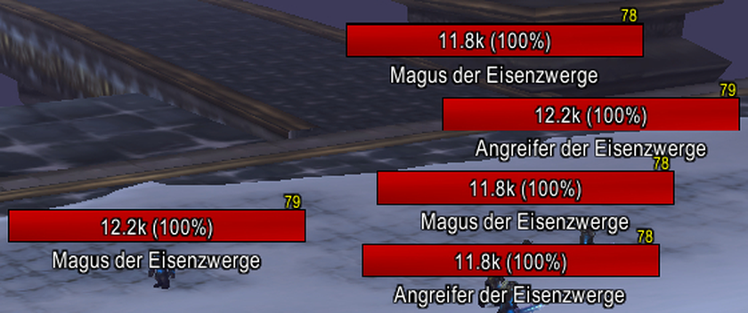
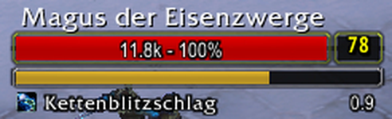
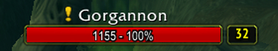
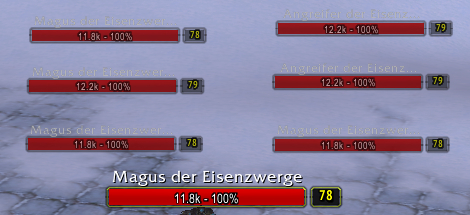
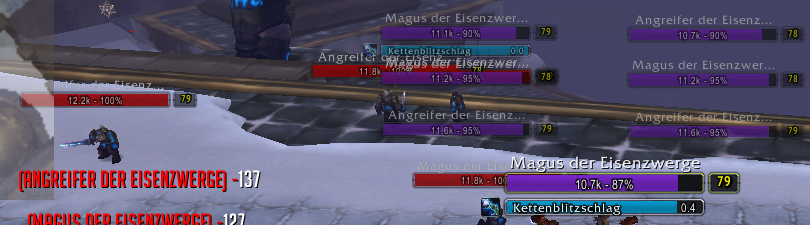
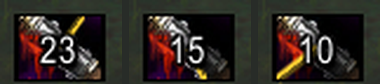
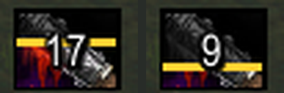

# 🟦 Tidy Plates Backport for WotLK 3.3.5a
> A fully functional, modernized backport for **World of Warcraft: Wrath of the Lich King (3.3.5a)**

[](CHANGES.md)
[](https://wowpedia.fandom.com/wiki/World_of_Warcraft:_Wrath_of_the_Lich_King)
[](LICENSE)

---

> [!NOTE]
> **This fork** builds on the
> [Hypopheria Remaster](https://github.com/hypopheria2k/TidyPlates_3.3.5a) and adds
> further performance work, non-target castbars without dropped events, GUID
> assignment without mouseover (raid markers, fingerprints, damage correlation),
> a Plater-like threat color scheme, an optional **Plater/NotPlater look** and
> **Classic look**, and built-in nameplate stacking. See **[CHANGES.md](CHANGES.md)**
> for details.
>
> - **Install:** copy `TidyPlates`, `TidyPlates_ThreatPlates` (and optionally
>   `TPProf`) into `Interface/AddOns/` and **restart the client completely** -
>   WoW 3.3.5a only picks up new files after a restart, `/reload` is not enough.
> - **Profiles:** the `Default` profile contains all optimizations and the color
>   scheme. The profiles `Plater` and `Classic` are created automatically and add
>   their look on top: `/tptp` -> *Profiles* -> select one, or type `/tptpplater`
>   / `/tptpclassic`. No reload needed.
> - **Options** for all additions: `/tptp` -> tab *Extensions*. All texts are
>   localized (English, German).
> - Disable ElvUI's nameplate module and nameplate stacking WeakAuras when using
>   this.
> - The combat log throttling described below (sections "Combat Log Throttling"
>   and "Performance Throttling") was **removed** in this fork because it
>   dropped events; the load is reduced by other means instead (see CHANGES.md).
>
> The text below the screenshots is the upstream README of the Hypopheria Remaster.

### Screenshots (this fork)

**Plater look** (profile `Plater`, `/tptpplater`): flat bar with a crisp 1 px
border, HP as `11.8k (100%)`, name below the bar, small level top right.

| | |
|---|---|
|  | Target with NotPlater target indicator (*Extensions* → *Plater look* → "Target indicator") and blue "Target glow". |
|  | In combat: purple = your aggro. Castbars on non-target plates too, with spell name and remaining time; orange = interruptible and your interrupt is ready (*Extensions* → *Castbar*). |
|  | Out of combat (red = hostile) with stacking: plates move out of each other's way instead of overlapping. |
|  | Target castbar with the 1 px border, HP as `72.8k (24%)`. |

**Classic look** (profile `Classic`, `/tptpclassic`): flat bar in a rounded frame,
separate level box, yellow-green line on the target.

| | |
|---|---|
|  | Castbar like WoW Forever: attached under the bar, as wide as bar + level box, yellow while your interrupt is ready (grey on cooldown, lock for uninterruptible casts); spell name and remaining time below. Purple bar = your aggro. |
|  | Combo points as a segmented strip under the target's bar, colored by count (1 blue … 5 red). |
|  | Quest icon in front of the name for mobs that are an open kill objective in the quest log (*Extensions* → *Quest icon*). |

**Stacking** (`/tptp` → *Extensions* → *Stacking*): enemy plates move out of each
other's way, the target stays pinned above its model ("Pin target").

| | |
|---|---|
|  | From 6 plates on (option "Two stacks from") a tower splits into two columns next to the target. |
|  | In combat only enemies fighting you or your group are stacked (option "Only stack engaged enemies", purple = your aggro); idle mobs (red, left) stay where they are. |

**Debuff timer** (`/tptp` → *Widgets* → *Debuffs* → "Display"): the elapsed
time of each debuff is shown on its icon ("Show elapsed time").

| | |
|---|---|
|  | "Clock" (default): dark sector from 12 o'clock with a golden hand (23 s, 15 s, 10 s left). |
|  | "Bar (grey)": the elapsed part is greyed out from the top, golden edge. |

> [!IMPORTANT]
> The original repository has been abandoned for years. This fork revives the addon with critical bug fixes, performance optimizations, and a fully working configuration interface.
> 
> **Version `6.6.0`** is an internal version number for this 3.3.5a backport and is *not* related to the original addon's versioning scheme.

## 🚀 Features at a Glance
- ✅ **Customizable Nameplates** – Multiple themes (Neon, Damage, Tank, etc.)
- 📊 **Threat Tracking** – Visual indicators (Tug-o-Threat, Threat Wheel)
- ⏱️ **Debuff Timers** – Configurable per row (`0 / 2 / 4 / 6` auras)
- 🧊 **Crowd Control Coloring** – CC'd enemies highlighted in light blue
- 🎯 **Non-Target Cast Bars** – NPC cast bars via combat log events
- ⚡ **Performance Throttling** – Reduces CPU load in large-scale encounters
- 💾 **Persistent Cache** – Class & aura settings survive `/reload`

## 📦 Installation
1. Download the latest release from the [Releases](../../releases) page.
2. Extract the `TidyPlates` folder into `World of Warcraft/Interface/AddOns/`.
3. Restart WoW or type `/reload` in-game.
4. Open the configuration panel via the minimap icon or `/tidyplates`.

## 🛠️ What’s Fixed & Improved
This fork resolves all known issues from the original backport and introduces several quality-of-life enhancements.

| Issue | Description | Solution |
| :--- | :--- | :--- |
| `#12` | Class cache lost after `/reload` | `TidyPlatesData` now initializes correctly in `ADDON_LOADED` |
| `#13` | Hardcoded 6 debuffs, no UI control | Added dropdown (`0/2/4/6`) in Hub panels; widget rebuilds dynamically |
| `#15` | Crowd-controlled units not colored | New `CrowdControl.lua` widget + health bar override (light blue) |
| `#11` | NPC cast bars missing due to `GetSpellInfo()` misuse | Fixed for 3.3.5a compatibility; removed invalid `castTime` check |

> All changes remain **100% backward compatible** with existing themes and saved variables.

## 🐾 Pet Health Bar Color
   – Differentiate player pets from their owners with a dedicated color picker.
   – Located under "Color" in the Hub panels (Damage/Tank), this setting applies a custom
     health bar color (default: violet) to all friendly player pets (hunter pets, ghouls, etc.).
   – The chosen color is saved per spec and persists across sessions.

## 🔧 Technical Deep Dive: Performance Optimizations
This fork implements low-level optimizations that significantly reduce CPU usage, especially in large raids or crowded zones (Wintergrasp, Alterac Valley).

### 1. Combat Log Throttling (~30 Hz)
> [!NOTE]
> **Before:** Every `COMBAT_LOG_EVENT_UNFILTERED` triggered full processing, causing frame drops in 40-man raids.  
> **After:** Time-based throttle (`0.033s`) silently ignores redundant events while maintaining smooth UI updates.

```lua
-- SpellCastMonitor.lua
local lastSpellCastProcessTime = 0
local SPELLCAST_THROTTLE = 0.033

local function OnCombatEvent(...)
    local now = GetTime()
    if now - lastSpellCastProcessTime < SPELLCAST_THROTTLE then return end
    lastSpellCastProcessTime = now
    -- ... process event ...
end
```

### 2. `GetSpellInfo()` – Fixed Cast Bars
> [!CAUTION]
> In 3.3.5a, `GetSpellInfo(spellid)` returns only 3 values: `(name, rank, icon)`. The original code expected 9, including `castTime`, which caused cast bars to fail.

```lua
-- Fixed (3.3.5a compatible)
local spell, _, icon = GetSpellInfo(spellid)
-- No castTime check needed – SPELL_CAST_START already guarantees a cast time > 0
```

### 3. SavedVariables Initialization
> [!TIP]
> `TidyPlatesData` is now eagerly initialized in `TidyPlatesCore.lua` and safely reinforced in `ADDON_LOADED`. This eliminates `nil` errors and guarantees cache persistence across sessions.

### 4. Defensive Widget API Calls
> Modules like `TidyPlates_ThreatPlates` now check for API existence before calling widget methods, preventing startup errors regardless of addon load order.

### 5. Dynamic Debuff Widget
> The debuff widget now supports **0 / 2 / 4 / 6** icons per row. Setting it to `0` completely disables event processing and memory allocation for debuffs. Changing the value instantly rebuilds all nameplates via `TidyPlates:ForceUpdate()`.

## 📈 Measurable Improvements
| Scenario | Original AddOn | This Fork |
| :--- | :--- | :--- |
| 📍 Idle in Dalaran | `1–2%` CPU | `<0.5%` CPU |
| ⚔️ 40-Man Raid Fight | `8–15%` CPU spikes | `3–5%` steady |
| 🎯 Cast Bar Updates | Target only | All casting NPCs |
| 🔄 Reload Behavior | Cache lost | Cache persists |

## ⚙️ New Configuration Options
Open the **Tidy Plates Hub** (Damage or Tank panel) to access:

### 📊 Debuffs per Line
- **Off (0)** – Disables widget & stops event processing
- **2 / 4 / 6** – Number of debuff icons displayed per row
> ⚡ Changes apply instantly. Nameplates rebuild automatically.

### 🧊 Crowd Control Color
Enemies affected by CC (Polymorph, Freezing Trap, Fear, etc.) now display a **light blue** (`#33aaff`) health bar & name. 
> 💡 Edit `CROWD_CONTROL_COLOR` in `CrowdControl.lua` to customize.

### ⚡ Performance Throttling
Both `SpellCastMonitor` and `DebuffWidget` include a **global 0.033s throttle**. No configuration required – it runs automatically.

## 🧪 Testing Instructions
1. `/reload` → Verify caches persist (`/dump TidyPlatesData`)
2. Attack a casting mob → Cast bar appears below nameplate (even if not targeted)
3. Apply CC → Enemy nameplate turns light blue
4. Hub → Widgets → "Debuffs per Line" → Set to `0` (icons vanish) → Set back to `2/4/6` (reappear)
5. Enter large battle (AV/Dungeon) → Verify smooth performance, no lag spikes

## 📜 Credits & Attribution
- **Original Authors:** Binbwen and Friends
- **Original WoTLK Backport:** [Kader](https://github.com/bkader/TidyPlates_WoTLK)
- **Fixes & Modernization:** [Hypopheria](https://github.com/hypopheria2k/TidyPlates_3.3.5a) + Community Contributions

## 🤝 Contributing
Issues and pull requests are highly welcome! Please ensure all changes are tested on a **3.3.5a client** before submitting.

## 📄 License
This project is licensed under the **MIT License**. See [`LICENSE`](LICENSE) for details.

---

## Screenshots

<table>
  <tr>
    <td></td>
    <td></td>
    <td></td>
  </tr>
</table>

---

**Made with ❤️ for the WoTLK private server community**  
